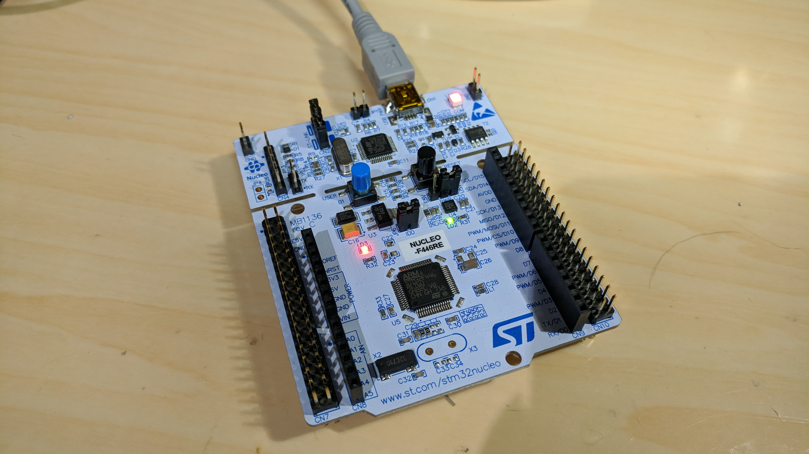
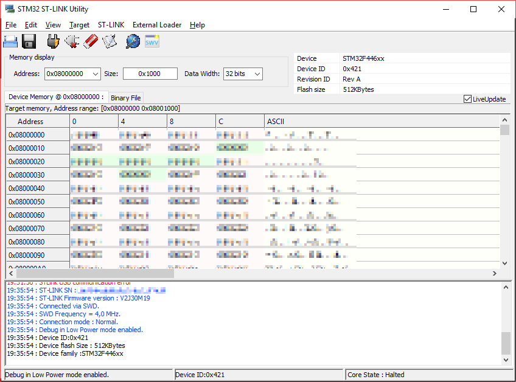
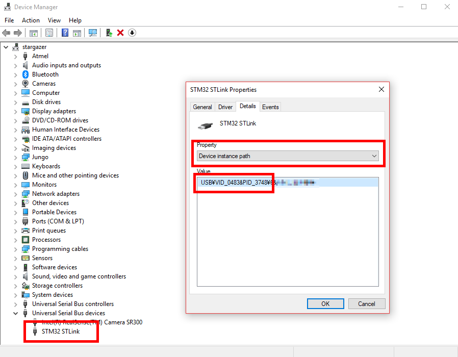

# OpenOCD binary builder on MSYS2/MinGW

* All additional libraries are statically linked ;)

## Built binaries

* See release page: https://github.com/kekyo/OpenOCDonMinGW/releases

## Prerequisities

* MSYS2 (http://www.msys2.org/)
  * [Currently tested on MSYS2 64bit environment (20161025)](http://repo.msys2.org/distrib/x86_64/msys2-x86_64-20161025.exe)

## Build

### Install and setup MSYS2

* You have to choose "final-result of target toolchain (gcc.exe, ld.exe ...) arch" for 64bit or 32bit.
* Be careful: You have to choose "MinGW console" instead "MSYS2 console".

#### 64bit: Open MinGW 64bit console and execute below:

```
pacman -Syuu
pacman -S unzip bzip2 base-devel mingw-w64-x86_64-toolchain mingw-w64-x86_64-libusb mingw-w64-x86_64-libusb-compat-git mingw-w64-x86_64-hidapi mingw-w64-x86_64-libftdi
```

#### 32bit: Open MinGW 32bit console and execute below:

```
pacman -Syuu
pacman -S unzip bzip2 base-devel mingw-w64-i686-toolchain mingw-w64-i686-libusb mingw-w64-i686-libusb-compat-git mingw-w64-i686-hidapi mingw-w64-i686-libftdi
```

### Build

* Execute `build.sh`
  * If building finished normally, OpenOCD built binaries store into "artifacts/openocd-\*\_\*.tar.bz2"
  * ex: "artifacts/openocd-0.10.0_mingw-w64-i686.tar.bz2"

* Configuration result:

```
libjaylink configuration summary:
 - Package version ................ 0.1.0
 - Library version ................ 0:0:0
 - Installation prefix ............ /d/PROJECT/OpenOCDonMinGW/stage/i686-w64-mingw32/openocd-0.10.0
 - Building on .................... i686-w64-mingw32
 - Building for ................... i686-w64-mingw32

OpenOCD configuration summary
--------------------------------------------------
MPSSE mode of FTDI based devices        yes (auto)
ST-Link JTAG Programmer                 yes (auto)
TI ICDI JTAG Programmer                 yes (auto)
Keil ULINK JTAG Programmer              yes (auto)
Altera USB-Blaster II Compatible        yes (auto)
Versaloon-Link JTAG Programmer          yes (auto)
OSBDM (JTAG only) Programmer            yes (auto)
eStick/opendous JTAG Programmer         yes (auto)
Andes JTAG Programmer                   yes (auto)
USBProg JTAG Programmer                 yes (auto)
Raisonance RLink JTAG Programmer        yes (auto)
Olimex ARM-JTAG-EW Programmer           yes (auto)
CMSIS-DAP Compliant Debugger            yes (auto)
Altera USB-Blaster Compatible           yes (auto)
ASIX Presto Adapter                     yes (auto)
OpenJTAG Adapter                        yes (auto)
SEGGER J-Link Programmer                yes (auto)
```

## Verify

* For example: Using STM32 Nucleo or discovery boards:
  * STM32F446 Nucleo-64 board

    

### Connect your device (or adapter)

* Easy way with [STM32 ST-LINK utility](http://www.st.com/ja/development-tools/stsw-link004.html)

  

* Device manager (Device ID)

  

### Execute OpenOCD

```
$ ./openocd.exe -f board/st_nucleo_f4.cfg
Open On-Chip Debugger 0.10.0
Licensed under GNU GPL v2
For bug reports, read
        http://openocd.org/doc/doxygen/bugs.html
Info : The selected transport took over low-level target control. The results might differ compared to plain JTAG/SWD
adapter speed: 2000 kHz
adapter_nsrst_delay: 100
none separate
srst_only separate srst_nogate srst_open_drain connect_deassert_srst
Info : Unable to match requested speed 2000 kHz, using 1800 kHz
Info : Unable to match requested speed 2000 kHz, using 1800 kHz
Info : clock speed 1800 kHz
Error: libusb_open() failed with LIBUSB_ERROR_NOT_SUPPORTED
Info : STLINK v2 JTAG v30 API v2 SWIM v19 VID 0x0483 PID 0x374B
Info : using stlink api v2
Info : Target voltage: 3.223392
Info : stm32f4x.cpu: hardware has 6 breakpoints, 4 watchpoints
```

## License

* MIT
